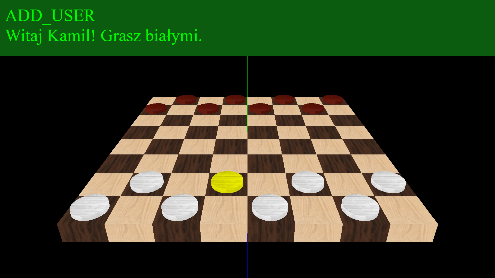

# Opis:
Niedokończony projekt gry w warcaby.

## Czego się nauczyłem?
Trochę Three.js, głównie ray castingu oraz synchronizacji graczy.

### Wykorzystane technologie:
HTML, CSS, JavaScript, jQuery, Node.js, Three.js, AJAX

#### Uruchomienie:
Aby uruchomić projekt musimy mieć zainstalowany Node.js.
Po pobraniu otworzyć konsolę w folderze projektu (przytrzymać SHIFT i kliknąć prawym na folder, następnie z menu podręcznego wybrać "Otwórz tutaj okno programu Powershell" lub podobne)).
W okienku konsoli wpisać "node server.js" lub "node .\server.js".
Jeśli polecenie nie działa być może wywoływane jest w folderze, w którym nie ma pliku "server.js".
Jeśli wszystko dobrze zrobiliśmy wyświetli się napis "Serwer startuje na porcie 3000".
Przechodzimy do przeglądarki i w pasku adresu wpisujemy "localhost:3000".
Powinien otworzyć się projekt.

##### Działanie projektu:
Podajemy swoją nazwę gracza i oczekujemy na drugiego.
Otrzymujemy stosowne komunikaty odnośnie graczy w grze.
W osobnej karcie podajemy inną nazwę i wchodzimy do gry.
Możemy przemieszczać pionki.

 
 
 
 
 
