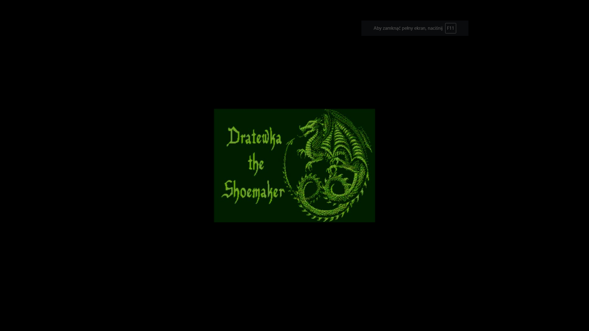
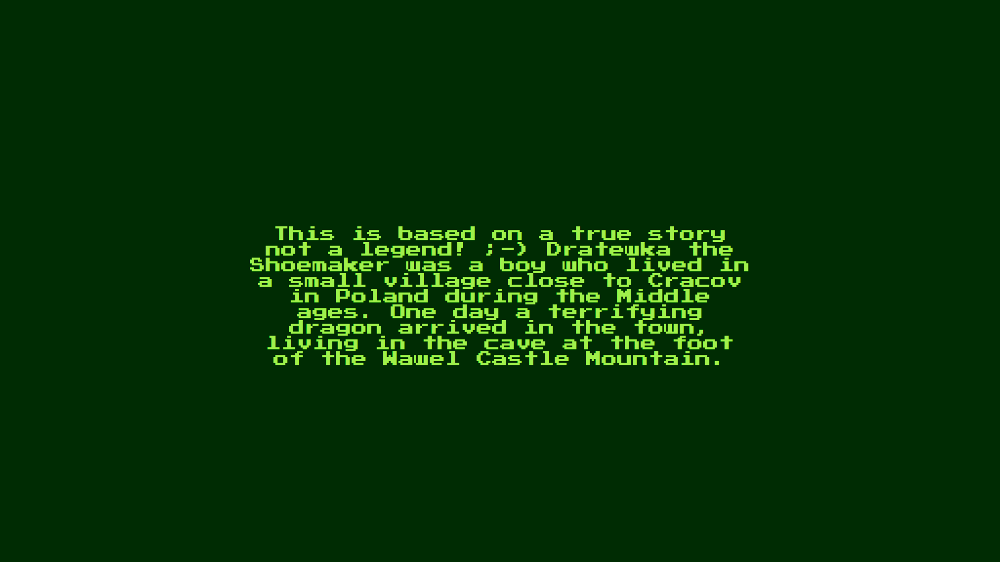
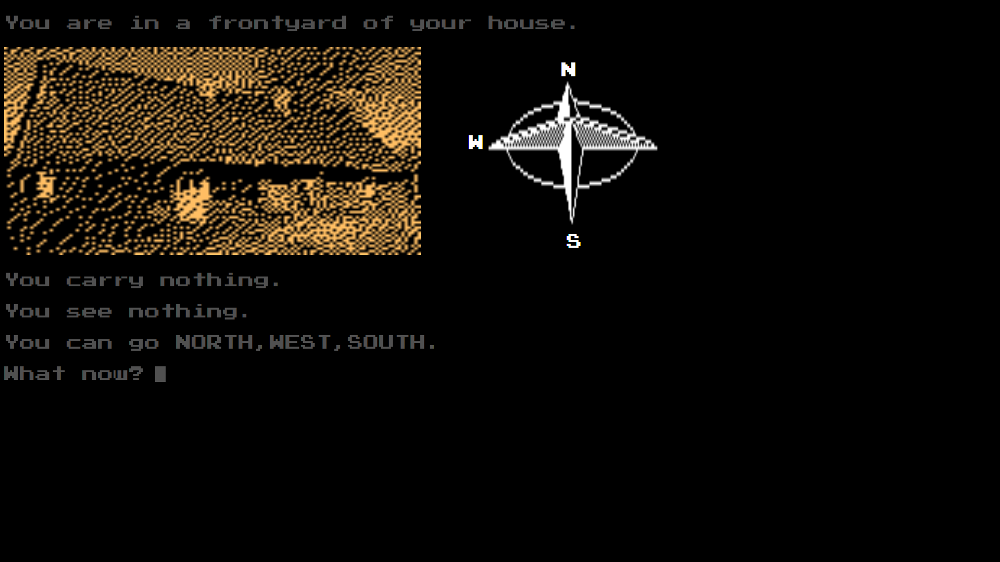

# Opis:
Gra "Dratewka" przeznaczona na stare generacje konsol, zrealizowana przy u�yciu JavaScript.

## Czego się nauczyłem?
Lepiej poznałem język JavaScript.

### Wykorzystane technologie:
HTML, CSS, JavaScript

#### Uruchomienie:
Po pobraniu kliknąć podwójnie w plik index.html.

##### Przebieg gry:
Po ekranie wprowadzajacym znajdujemy się w świecie Dratewki.
Naszym zadaniem jest zebranie wszystkich części owcy.
Aby to zrobić musimy sukcesywnie kolekcjonować kolejne przedmioty przemieszczajac się po lokacjach.
Kompas wskazuje nam gdzie możemy się udać.
Wpisując "VOCABULARY" przejdziemy do wszystkich możliwych poleceń w grze.
Wpisując "GOSSIPS" poznamy drobne podpowiedzi do gry.
Na ekranie widzimy:
- co nosimy ze sobą (maksymalnie 3 przedmioty)
- co widzimy i możemy to wziąć
- kierunki, w których możemy się poruszać
Aby tworzyć kolejne przedmioty i mieć postępy w grze musimy używać odpowiednich przedmiotów które mamy ze sobą na odpowiednich lokacjach.
W folderze "Materials" znajduje się mapa lokacji dla szybszej eksploracji świata.
Gra kończy się po stworzeniu owcy i podaniu jej smoku.

 
 
 
