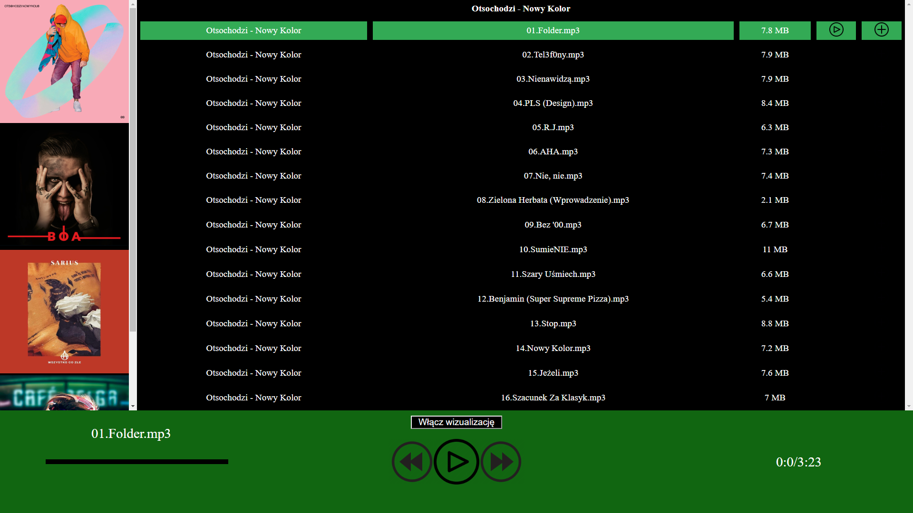
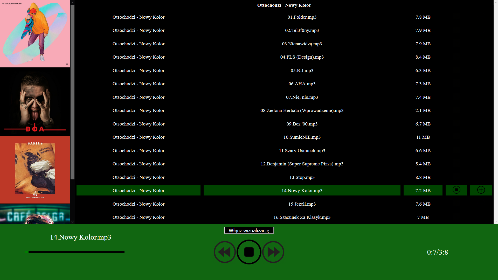
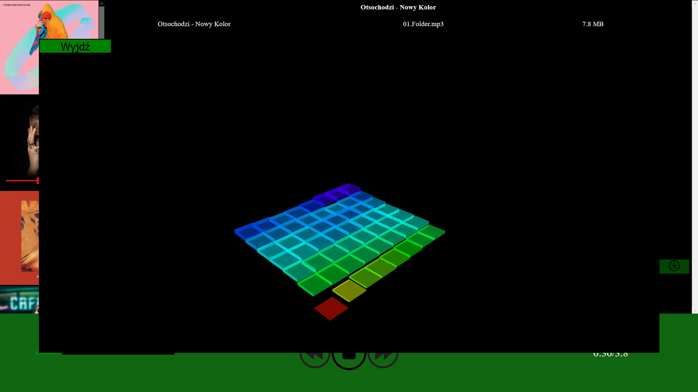
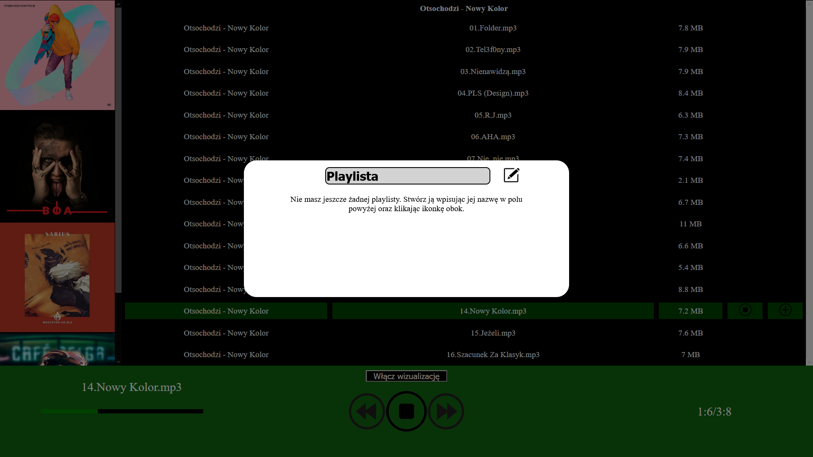
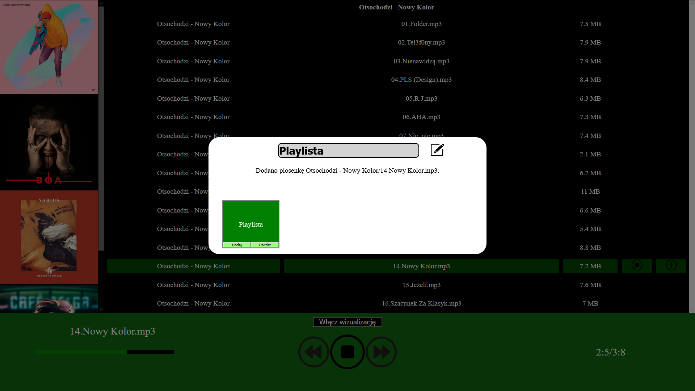
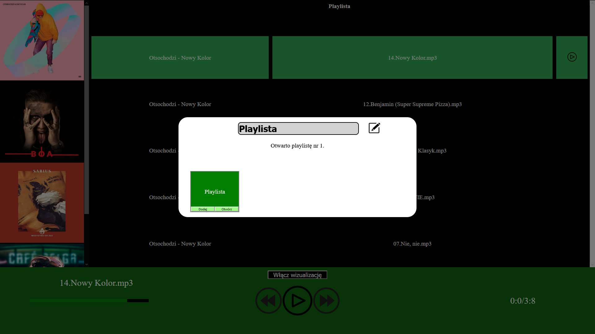

# Opis:
Odtwarzacz muzyki.

## Czego siê nauczy³em?
Nauczy³em siê u¿ywaæ AJAXa oraz jQuery. 
Stworzy³em prosty serwer w Node.js, gdzie odczytywa³em pliki mp3 z lokalnego folderu.
Skorzysta³em z biblioteki Three.js.
Budowê aplikacji opar³em na klasach i metodach, tworz¹c uporz¹dkowan¹ strukturê projektu.

### Wykorzystane technologie:
HTML, CSS, JavaScript, jQuery, Node.js, Three.js, AJAX

#### Uruchomienie:
Aby uruchomiæ projekt musimy mieæ zainstalowany Node.js.
Po pobraniu otworzyæ konsolê w folderze projektu (przytrzymaæ SHIFT i klikn¹æ prawym na folder, nastêpnie z menu podrêcznego wybraæ "Otwórz tutaj okno programu Powershell" lub podobne)).
W okienku konsoli wpisaæ "node server.js" lub "node .\server.js".
Jeœli polecenie nie dzia³a byæ mo¿e wywo³ywane jest w folderze, w którym nie ma pliku "server.js".
Jeœli wszystko dobrze zrobiliœmy wyœwietli siê napis "Serwer startuje na porcie 3000".
Przechodzimy do przegl¹darki i w pasku adresu wpisujemy "localhost:3000".
Powinien otworzyæ siê projekt.

##### Dzia³anie projektu:
Z panelu po lewej wybieramy albumy.
W³¹czamy muzykê klikaj¹c ikonkê "play".
Mo¿emy j¹ dowolnie pauzowaæ i wznawiaæ, równie¿ przy u¿yciu du¿ych kontrolek pod list¹ piosenek.
Klikaj¹c ikonkê plusa mo¿emy tworzyæ playlisty. 
Jeœli jeszcze takiej nie mamy, wpisujemy nazwê i klikamy ikonkê z o³ówkiem. 
Jeœli ju¿ mamy, po prostu wybieramy j¹ i klikamy "Dodaj" (do albumu zostanie dodana wybrana piosenka).
Otwieramy j¹ po wejœciu w piosenkê i klikniêciu "Otwórz".
Mo¿emy w³¹czyæ wizualizacjê utworu klikaj¹c "W³¹cz wizualizacjê".
Projekt nie dzia³a na przegl¹darce Chrome, gdy¿ tam blokowany jest dŸwiêk.
Pojawia siê drobny bug z ca³kowitym czasem trwania piosenki przy niektórych albumach (wczeœniej go nie by³o).

 
 
 
 
 
 
