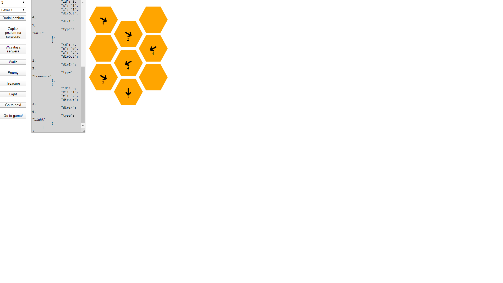
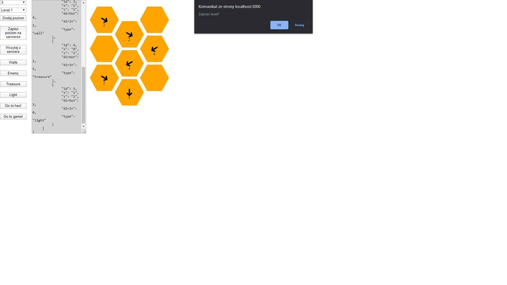
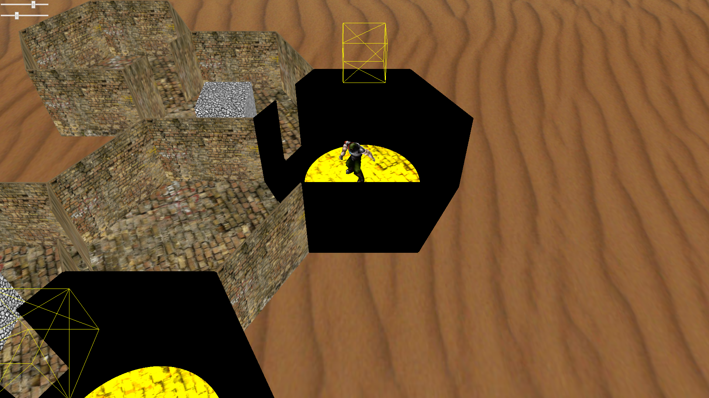

# Opis:
Niedokoñczona wersja gry o labiryncie.

## Czego siê nauczy³em?
G³ównie poznawa³em bibliotekê Three.js.

### Wykorzystane technologie:
HTML, CSS, JavaScript, jQuery, Node.js, Three.js

#### Uruchomienie:
Aby uruchomiæ projekt musimy mieæ zainstalowany Node.js.
Po pobraniu otworzyæ konsolê w folderze projektu (przytrzymaæ SHIFT i klikn¹æ prawym na folder, nastêpnie z menu podrêcznego wybraæ "Otwórz tutaj okno programu Powershell" lub podobne)).
W okienku konsoli wpisaæ "node server.js" lub "node .\server.js".
Jeœli polecenie nie dzia³a byæ mo¿e wywo³ywane jest w folderze, w którym nie ma pliku "server.js".
Jeœli wszystko dobrze zrobiliœmy wyœwietli siê napis "Serwer startuje na porcie 3000".
Przechodzimy do przegl¹darki i w pasku adresu wpisujemy "localhost:3000".
Powinien otworzyæ siê projekt.

##### Dzia³anie projektu:
Najpierw budujemy labirynt.
Klikaj¹c w hexagony pojawiaj¹ siê na nich strza³ki, s¹ to kierunki w jakich bêd¹ otwarte przejœcia do nastêpnych elementów labiryntu.
Z panelu po lewej mo¿emy zmieniaæ typy elementów labiryntu.
Pojedynczego hexa mo¿emy podejrzeæ klikaj¹c "Go to hex!".
Klikaj¹c "Go to game!" zostanie wygenerowany labirynt.
Mo¿emy zmieniaæ ustawienie œwiate³, jeœli dodaliœmy je przy tworzeniu labiryntu.
Typ "Enemy" nie zosta³ zaprogramowany.

 
 
 
 
 