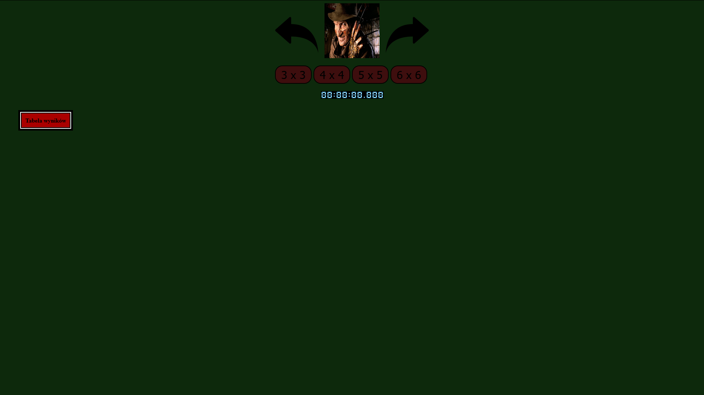
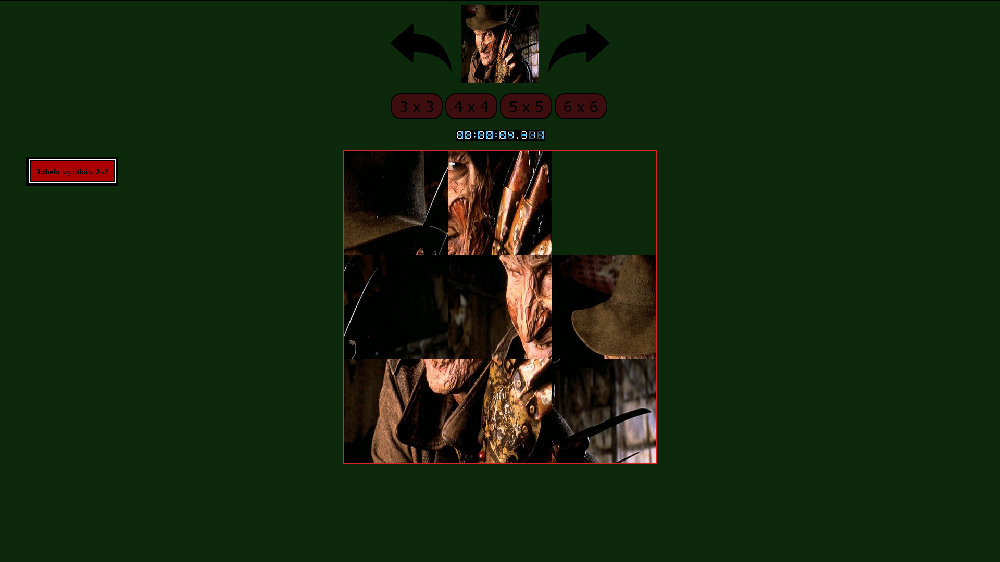
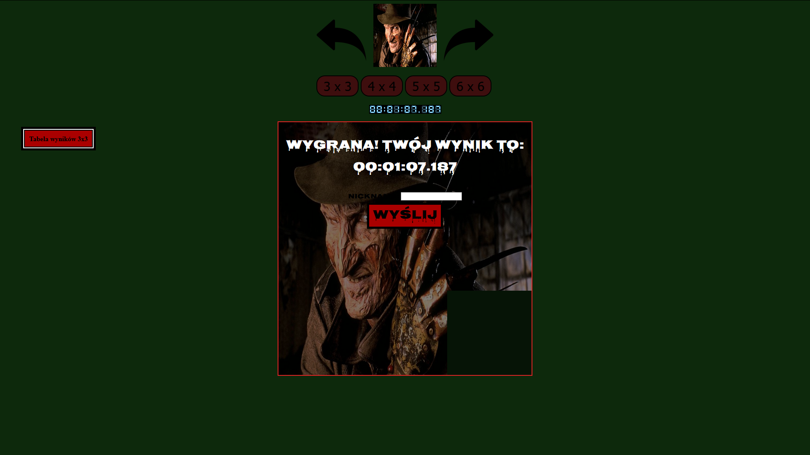
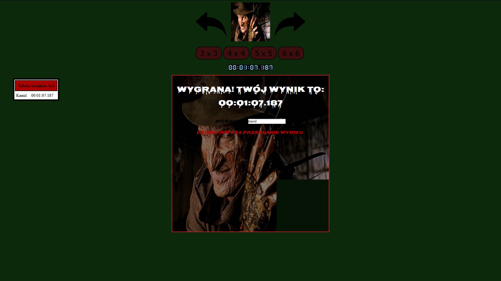
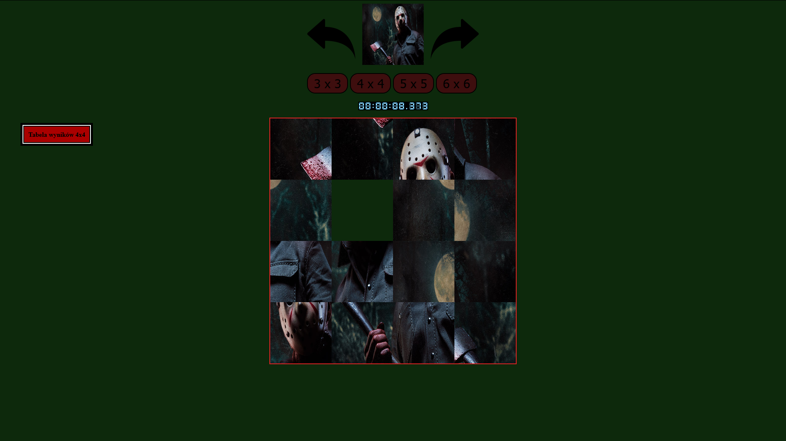
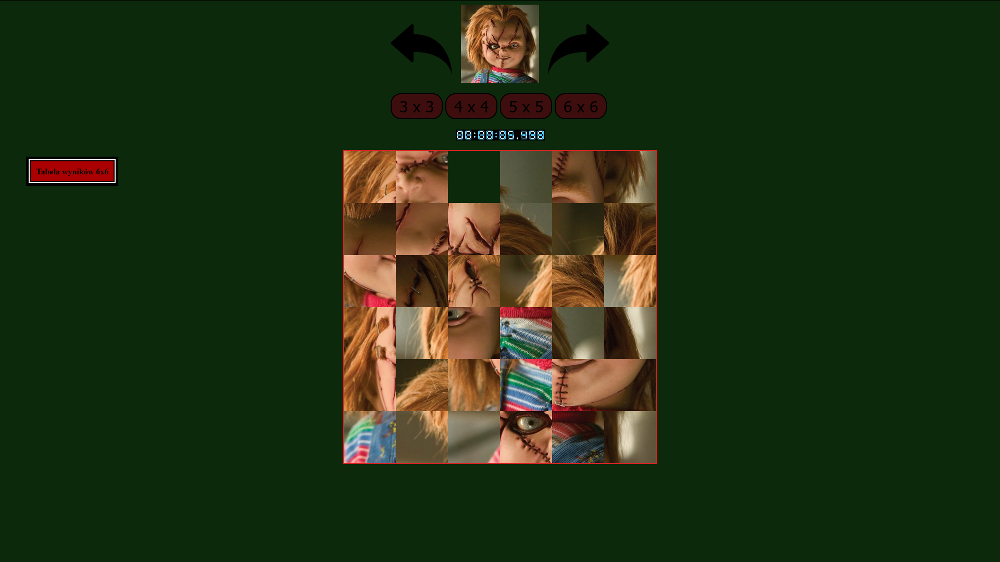

# Opis:
Gra w "Piêtnastkê".

## Czego siê nauczy³em?
Poza lepszym poznaniem Javascript u¿y³em te¿ ciasteczek do zapisywania wyników graczy.

### Wykorzystane technologie:
HTML, CSS, JavaScript, cookies

#### Uruchomienie:
Po pobraniu klikn¹æ dwa razy w plik Piêtnastka.

##### Przebieg gry:
Wybieramy jeden z 4 trybów gry.
Po pomieszaniu puzzli klikaj¹c w element obok pustego kwadraciku przeniesiemy go w jego miejsce.
Gra koñczy siê po u³o¿eniu obrazka.
Po podaniu naszego wyniku zostaniemy umieszczeni w rankingu.
Strza³kami u góry mo¿emy zmieniaæ obrazki, zostan¹ one pomieszane po ponownym wybraniu trybu (klikniêciu jednego z 4 przycisków).

 
 
 
 
 
 
