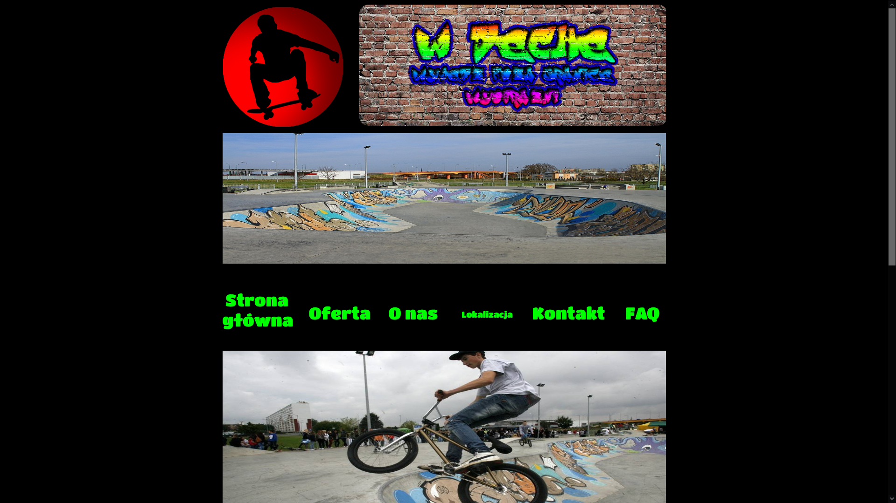
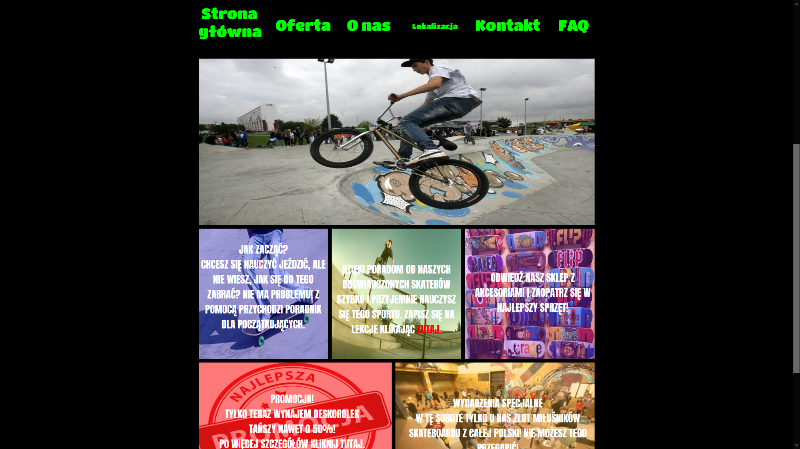
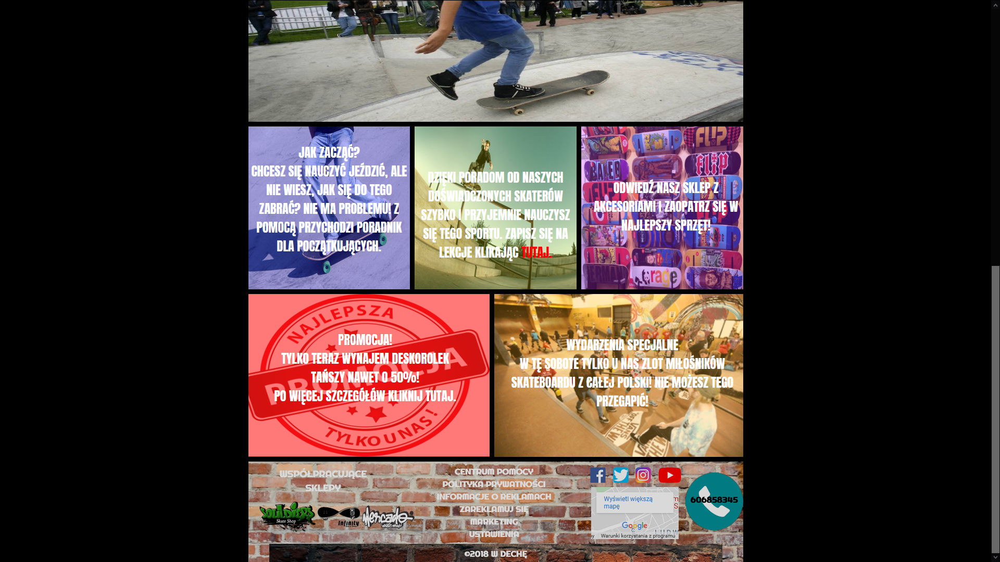

# Opis:
Pierwszy projekt strony internetowej, któr¹ stworzy³em na zajêciach w szkole jako projekt koñcoworoczny.

## Czego siê nauczy³em?
Nauczy³em siê tworzyæ graficznie projekt strony przy u¿yciu Adobe Photoshop, nastêpnie go okodowa³em.

### Wykorzystane technologie:
HTML, CSS, troszkê JavaScript do baneru

#### Uruchomienie:
Po pobraniu wystarczy kilkn¹æ dwa razy w plik index.html i strona powinna siê otworzyæ.

 
 
 
