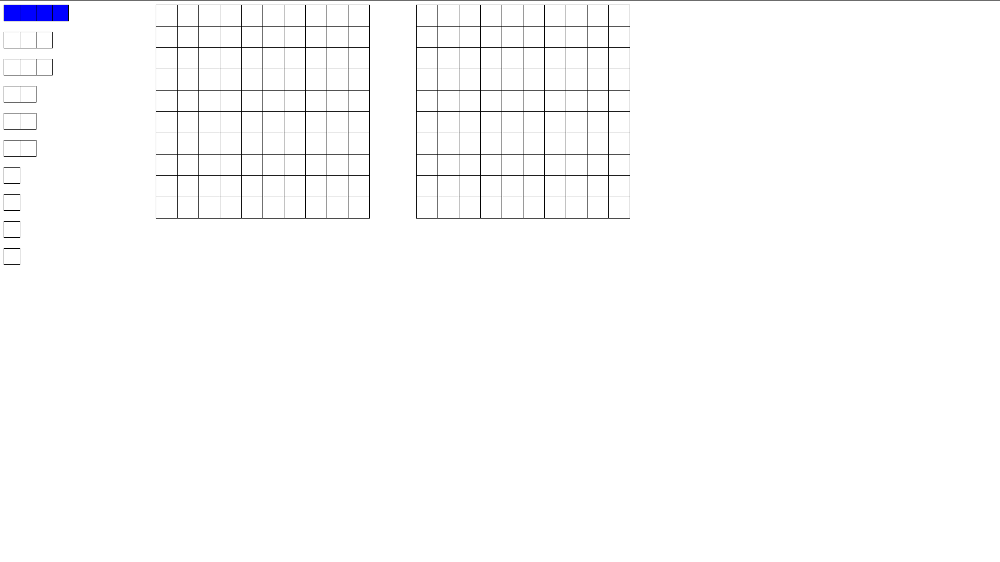
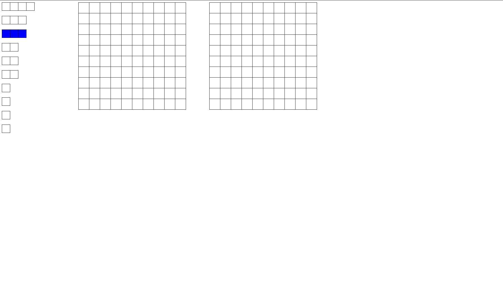
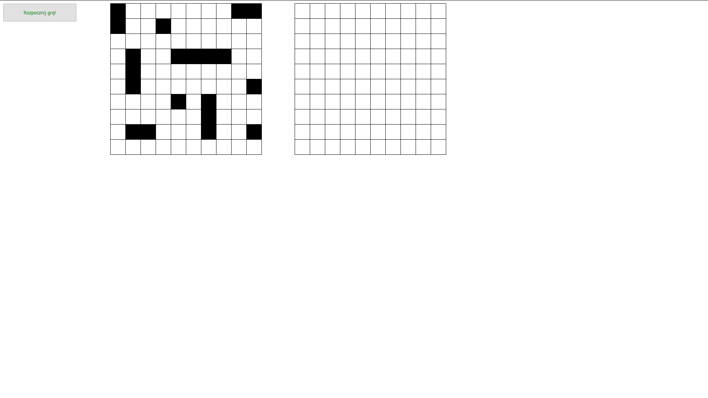
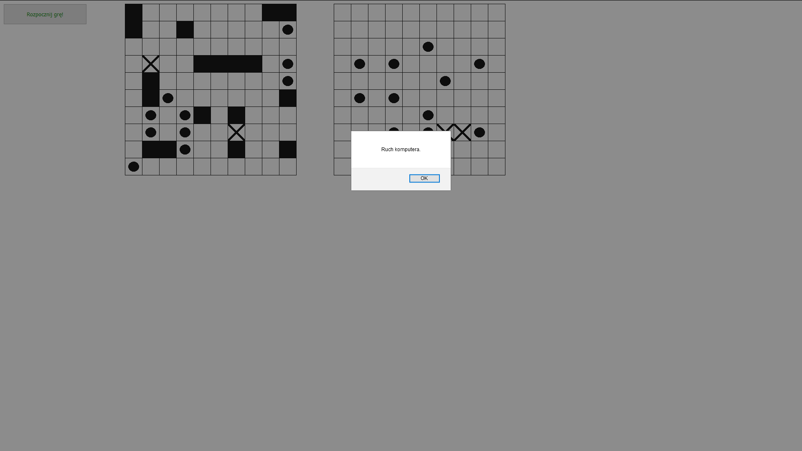
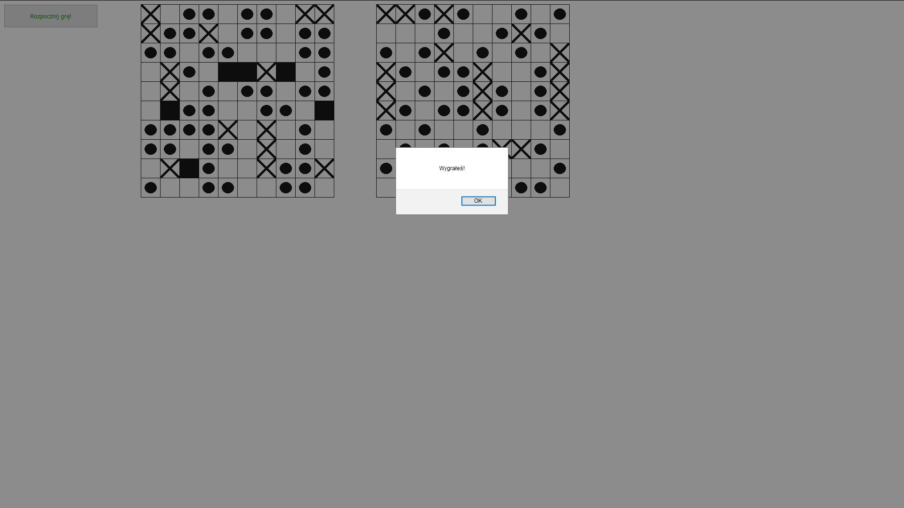

# Opis:
Prosta gra w statki.

## Czego siê nauczy³em?
Ca³¹ logika gry zosta³¹ wykonana w JavaScript. By³ to pierwszy powa¿niejszy projekt w tym jêzyku, jaki stworzy³em.
U¿ywa³em g³ównie samych funkcji. 
Pozna³em kilka algorytmicznych rozwi¹zañ.

### Wykorzystane technologie:
HTML, CSS, JavaScript

#### Uruchomienie:
Po pobraniu klikn¹æ podwójnie w plik Statki - projekt.

##### Przebieg gry:
Z panelu po lewej stronie wybieramy statki do rozmieszczenia na naszej planszy (po lewej).
Prawym przyciskiem mo¿emy zmieniæ orientacjê statku (pionow¹ lub poziom¹).
Po rozmieszczeniu statków klikamy przycisk, który pojawi siê w lewym górnym rogu.
Komputer strzela "na œlepo" w nasze statki.
Klikamy w planszê komputera po prawej. Krzy¿yk oznacza trafiony element statku, natomiast kropka - nietrafiony.
Gra koñczy siê po trafieniu wszystkich statków komputera.
Ustawienie statków komputera generowane jest losowo za ka¿dym razem.

 
 
 
 
 