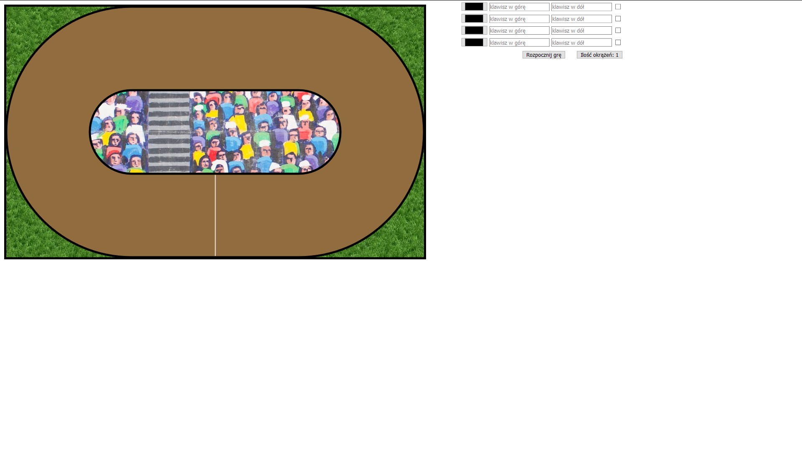
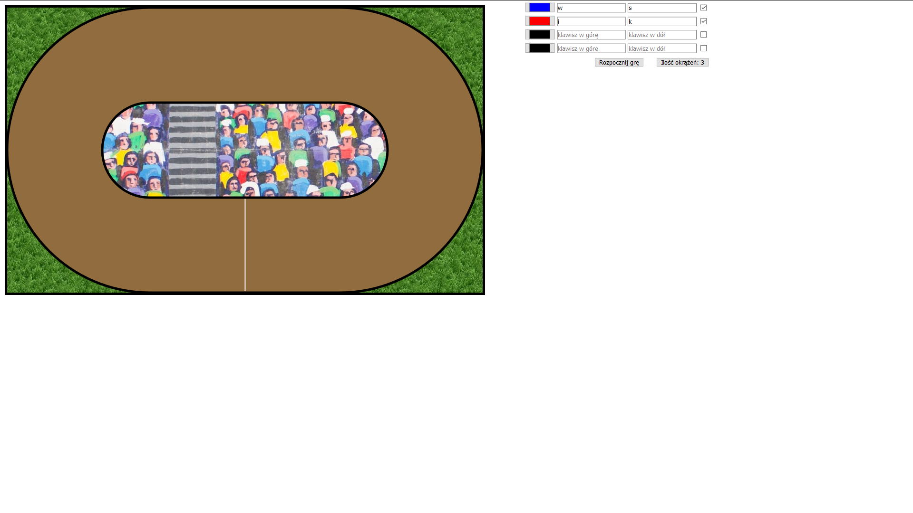
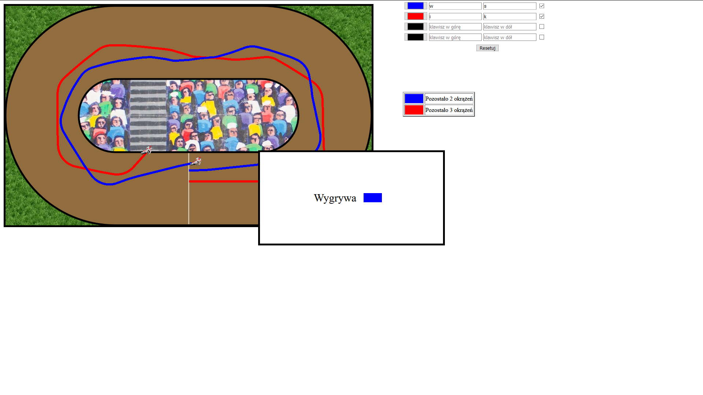

# Opis:
Prosta gra w ¯u¿el.

## Czego siê nauczy³em?
Nauczy³em siê podstawowych poleceñ przy u¿yciu Canvasa.

### Wykorzystane technologie:
HTML, CSS, JavaScript, Canvas

#### Uruchomienie:
Po pobraniu klikn¹æ podwójnie w plik index.html.

##### Przebieg gry:
W panelu po prawej wybieramy klawisze graczy i ich kolor, zaznaczaj¹c checkboxa w³¹czamy go do gry.
Mo¿emy okreœliæ iloœæ okr¹¿eñ.
Gra polega na dotarciu na metê bez st³uczki.
Wygrywa ostatni gracz, który przetrwa³ lub pierwszy na mecie.

 
 
 